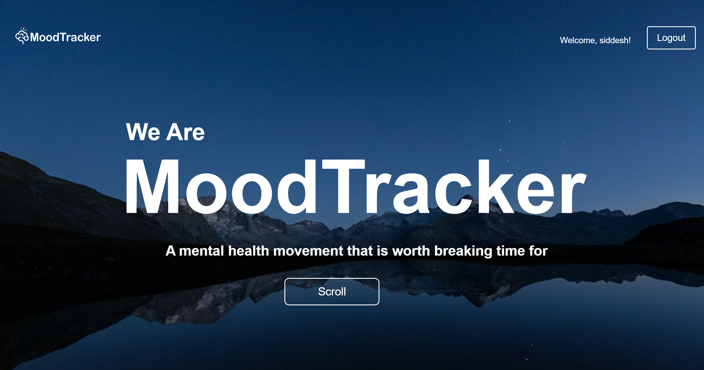
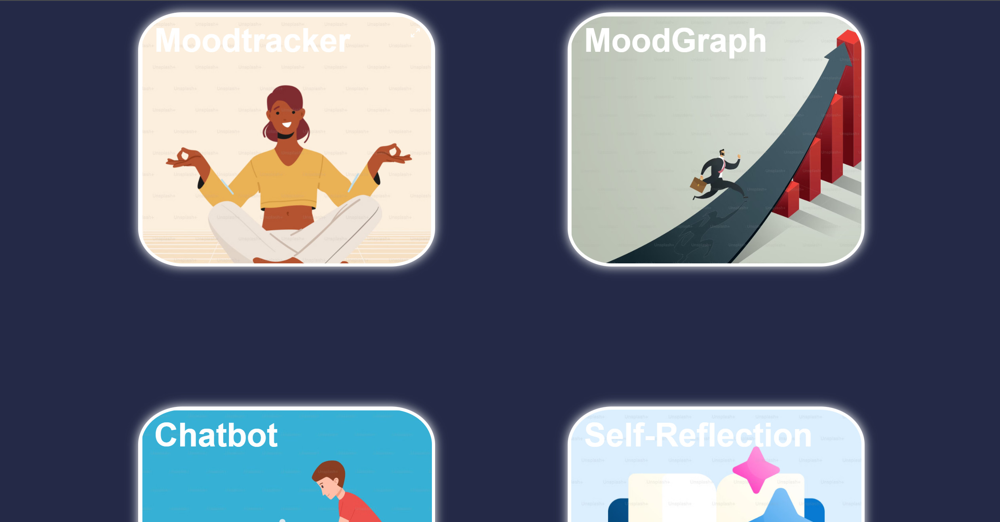
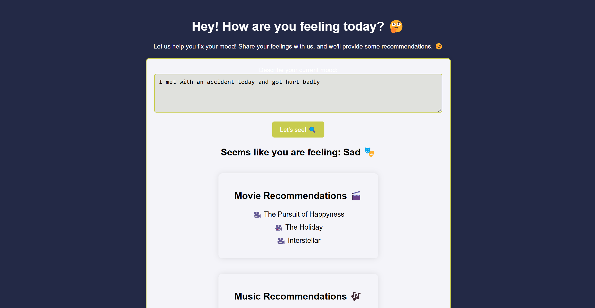
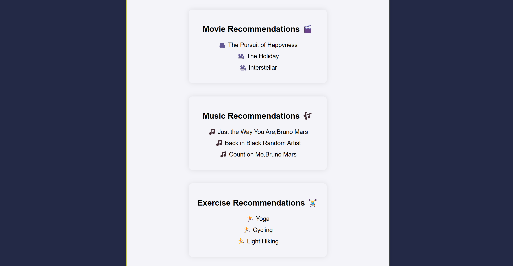
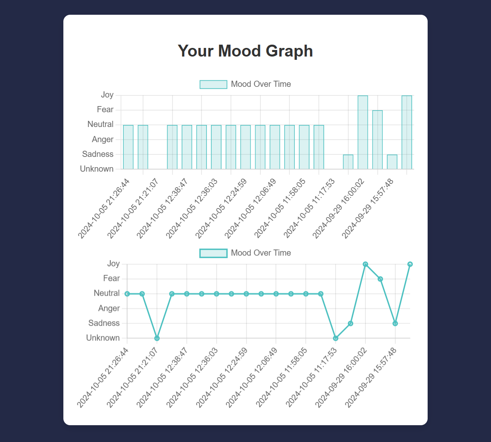
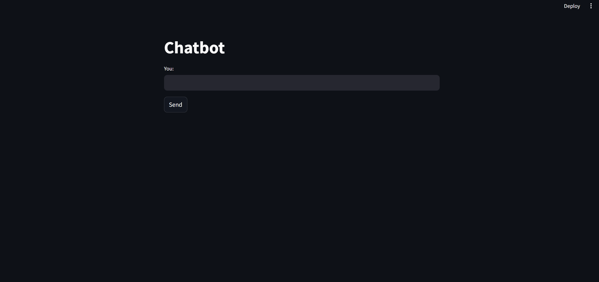
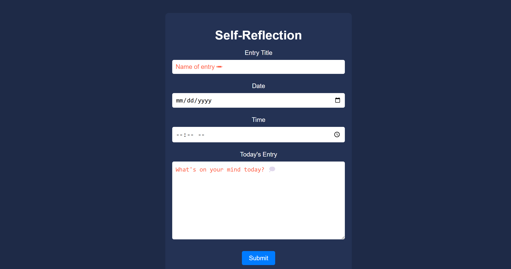
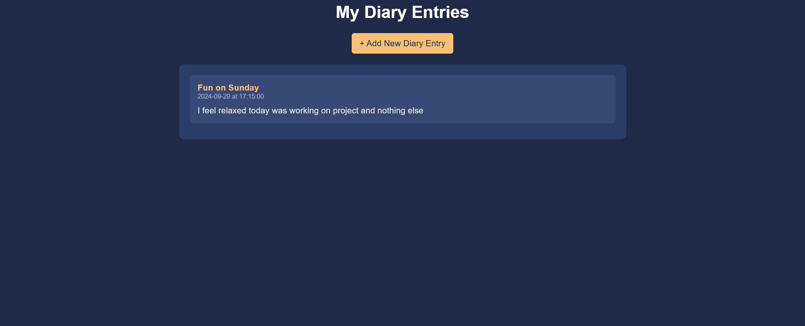

# NeuroAI: Enhancing Emotional Well-being through Technology 🧠

## Overview 📖
In a world where mental health is becoming increasingly crucial, **NeuroAI** offers a technology-driven solution to help users understand and manage their emotions. By combining **natural language processing**, **machine learning**, and **real-time sentiment analysis**, this platform provides personalized recommendations to enhance emotional well-being.

### Key Features:
- 🎭 **Mood Analysis**: Predict users' emotional states from text inputs using advanced sentiment analysis.
- 🎵 **Personalized Suggestions**: Recommend exercises, music, or movies tailored to the user's mood.
- 📔 **Daily Journaling**: Log emotional states with a diary feature and track changes over time.
- 📊 **Mood Trends**: Visualize mood trends using dynamic charts.
- 🤖 **AI Chatbot**: Integrated with the **Gemini API** for conversational support.

---

## Why NeuroAI? 🤔
Understanding emotions can be challenging. NeuroAI bridges the gap by offering:
1. **Accessibility**: Available anytime, anywhere, as a first step toward mental wellness.
2. **Real-Time Support**: Instant feedback and suggestions for mood improvement.
3. **Advanced Technology**: Built on cutting-edge machine learning models and APIs to ensure robust performance.

---

## Technologies ⚙️
**Languages**: Python, JavaScript, HTML, CSS  
**Frameworks**: Flask, TensorFlow, Streamlit  
**APIs**: Google Gemini, Gradio  
**Libraries**: NumPy, Pandas, NLTK, Chart.js, Matplotlib  
**Tools**: VS Code, Jupyter Notebook, Git/GitHub  

---

## Methodology 🚀
### 1. Data Preprocessing
- 🧹 **Cleaning**: Removing unnecessary elements like punctuation, URLs, and stopwords.
- ✂️ **Tokenization**: Converting text into structured sequences.
- 📂 **Splitting**: Dividing datasets into training and testing subsets.

### 2. Machine Learning Pipeline
- 🏗️ **Model Architecture**: Bidirectional LSTM with Conv1D layers for sentiment analysis.
- 🛡️ **Regularization**: Implementing dropout layers to prevent overfitting.
- 📊 **Visualization**: Mood trends displayed using **Chart.js**.

---

## Literature Survey 📚

| Title | Author(s) | Year | Key Insights | Limitations |
|-------|-----------|------|--------------|-------------|
| **Mindset: An Android-Based Mental Wellbeing Support Mobile Application** | Malaika Samuel, C.P. Shirley | 2023 | Android app with mood tracking, journaling, and mindfulness tools. | Limited long-term engagement; data security concerns. |
| **Mobile Application for Mental Health Using Machine Learning** | Mendis E.S., et al. | 2022 | ML-based detection of stress and anxiety. | Lacks personalization; privacy issues. |
| **Mental Health Mobile Apps to Empower Psychotherapy** | Federico Diano, et al. | 2022 | Focus on blending apps with psychotherapy. | Simplifies complex issues; lacks therapist interaction. |

---

## Limitations of Existing Systems 🚧
- 🌐 **Accessibility**: Language barriers or locked features limit access.
- 🎭 **Lack of Personalization**: Static recommendations fail to adapt to mood changes.
- 🔒 **Data Privacy**: Challenges in safeguarding sensitive user data.

---

## Future Goals 🌟
- 🌍 Add **multilingual support** for wider accessibility.
- 🤝 Improve **emotion detection** for complex and mixed feelings.
- ⏱️ Implement **real-time adjustments** to recommendations.

---

## Get Started 🛠️
### Requirements:
- Python 3.12.1  
- Node.js for Chart.js integration  
- TensorFlow, NumPy, Pandas, NLTK libraries


## Screenshots:























### Steps to Run
1. Clone this repository:
   ```bash
   git clone https://github.com/triumph10/NeuroAI.git

## License
This project is licensed under the MIT License

